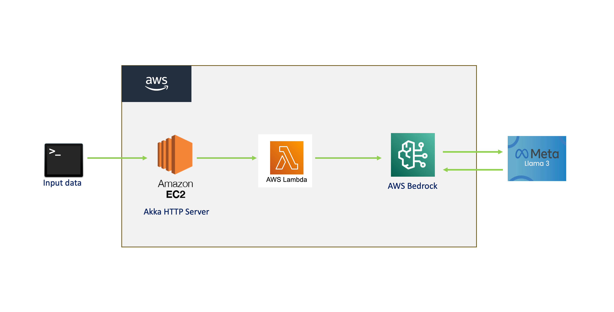

# AWS-Bedrock-Based-LLM-Conversation-API-with-Ollama-Integration with Dockerized Deployment

**Author**: Sunil Kuruba <br />
**Instructor**: Mark Grechanik <br />
**YouTube video**: https://youtu.be/IRPrV_GgbEI  <br />

## Description
This project demonstrates the integration of AWS Bedrock, Ollama, and AWS Lambda to create a conversational API. The system mimics a chatbot conversation where AWS Bedrock generates text, and Ollama responds accordingly, facilitated through AWS Lambda. The project uses Akka HTTP to handle requests and responses, gRPC for service communication, **Docker** for containerizing the Scala program deployed on the EC2 instance, and AWS API Gateway for managing the API.

The workflow begins with a request sent using **Postman** or **cURL** containing a sample input. This input is passed to the **Akka HTTP server** running on an AWS EC2 instance, which is deployed using **Docker** for seamless scalability and portability. The Akka HTTP server then makes a **gRPC call** to an AWS Lambda function. The Lambda function invokes **AWS Bedrock** to generate a sentence. The output generated by Bedrock is passed back to Lambda, then returned to the Akka HTTP server, which forwards it to **Ollama**.

At this point, the Bedrock output is used as an **input to Ollama**, which generates a conversational response. This Ollama output is then passed as input back to Bedrock, creating a back-and-forth conversational flow between Bedrock and Ollama. This iterative exchange enables the system to simulate a dynamic, multi-turn conversational interaction.
<br />
<br />


## Architecture Overview
- **Client Interface**: The interaction begins with Postman or curl, where a client sends a request.
- **Akka HTTP Server**: An Akka HTTP server listens for incoming requests and routes them to appropriate endpoints.
- **AWS Lambda**: The Akka HTTP server makes a gRPC call to AWS Lambda, which then communicates with AWS Bedrock to generate text.
- **AWS Bedrock**: AWS Bedrock is used for generating responses for the chatbot.
- **Ollama**: After the response from AWS Bedrock, it is passed to Ollama, and Ollama provides further responses to mimic the conversation flow.
- **AWS API Gateway**: It acts as the front-facing service for API requests.

## Project Structure

Project Structure:
```
├── src
│   ├── main
│   │   ├── scala
│   │   │   ├── AkkaHttpServer.scala            # Akka HTTP server for managing requests/responses
│   │   │   ├── Endpoint.scala                 # Defines API endpoints for communication
│   │   │   ├── LambdaInvoker.scala            # Code for invoking AWS Lambda functions for backend processing
│   │   │   ├── OllamaAPIClient.scala          # Defines API to interact with Ollama
│   │   ├── resources
│   │   │   ├── application.conf               # Configuration file for settings like API endpoints, model details, etc.
│   ├── test...
├── target                                     # Compiled files and build output
├── .gitignore                                 # Git ignore file
├── build.sbt                                  # Build configuration file for SBT
├── Dockerfile                                 # Docker file
└── README.md                                  # Project documentation
```

## Prerequisites
Ensure the following are installed and configured:
- **Scala (version 2.12 or compatible)**
- **Akka HTTP** (for building RESTful API)
- **AWS EC2**
- **AWS Lambda and API Gateway setup** (for invoking Lambda functions)
- **AWS Bedrock** (for text generation via LLM)
- **Ollama setup** (for local LLM model)
- **gRPC** (for interaction between services)
- **SBT** (Scala Build Tool for building the project)
- **Java Development Kit (JDK) 8 or higher**
- **Docker** (for containerized services if needed)

# Steps to Execute the Project

## 1. Clone the Repository

### Clone the GitHub repository to your local machine:
```bash
git clone https://github.com/SunilKuruba/AWS-Bedrock-Based-LLM-Conversation-API-with-Ollama-Integration.git
```

### Navigate to the project directory:
```bash
cd <project-directory>
```

---

## 2. Set Up EC2 Instance

1. Launch an AWS EC2 instance with the necessary specifications for running a Scala application.
2. Deploy the Scala application jar containing the Akka HTTP server to the EC2 instance.

---
## 3. Configure AWS API Gateway

Setting up AWS API Gateway involves creating RESTful endpoints, configuring them to invoke AWS Lambda functions, and updating the configuration file with the gateway route. Follow these detailed steps:

---

### **Step 1: Create a New API Gateway**
1. **Log in to the AWS Management Console**:
   - Navigate to the [API Gateway Console](https://console.aws.amazon.com/apigateway/).

2. **Create an API**:
   - Click on **Create API** and choose **HTTP API** (simpler and modern option) or **REST API** (classic and more feature-rich).
   - For this setup, select **REST API** and click **Build**.

3. **Configure API Settings**:
   - Enter a name for your API, such as **ChatbotAPI**.
   - Choose **Regional** as the endpoint type.
   - Click **Create API**.

---

### **Step 2: Create and Configure an API Resource and Method**
1. **Add a Resource**:
   - In the API dashboard, click **Resources** in the left-hand menu.
   - Click **Create Resource** and specify a name, e.g., `chatbot`. This will create a `/chatbot` route.
   - Enable **CORS** if the API will be accessed from a browser.

2. **Add a Method**:
   - Select the `/chatbot` resource and click **Create Method**.
   - Choose **POST** (or another HTTP method as needed) and click the checkmark.

3. **Integrate the Lambda Function**:
   - Under "Integration type," select **Lambda Function**.
   - Enter the name of the Lambda function you want to invoke (e.g., `ChatbotHandler`).
   - Click **Save** and confirm when prompted to add the necessary permissions for API Gateway to invoke the Lambda function.

---

### **Step 3: Deploy the API**
1. **Deploy the API**:
   - Click on **Actions** in the **Resources** section and select **Deploy API**.
   - Create a new deployment stage, e.g., `prod`.
   - Note the **Invoke URL** (e.g., `https://<api-id>.execute-api.<region>.amazonaws.com/prod/chatbot`). This is the endpoint your clients will call.

2. **Test the API**:
   - Use **Postman** or **cURL** to send a POST request to the deployed endpoint with a sample payload.
   - Example `curl` command:
     ```bash
     curl -X POST -H "Content-Type: application/json" -d '{"message": "Hello"}' https://<api-id>.execute-api.<region>.amazonaws.com/prod/chatbot
     ```

---

### **Step 4: Update the Configuration File**
1. **Locate the Configuration File**:
   - Open the configuration file (e.g., `application.conf` or `config.json`) in your project.

2. **Update the `awsLambdaApiGateway` Setting**:
   - Add or update the gateway route in the configuration file with the **Invoke URL**:
     ```json
     {
       "awsLambdaApiGateway": "https://<api-id>.execute-api.<region>.amazonaws.com/prod/chatbot"
     }
     ```

3. **Save the File**:
   - Ensure the file is saved and deployed with your application.

---

## 4. Set Up AWS Lambda

1. Create a Lambda function in AWS and upload the Python code located in:
   ```bash
   src/main/aws/lambda.py
   ```
2. Ensure that the Lambda function is correctly configured to communicate with AWS Bedrock.

---

## 5. Set Up AWS Bedrock

1. Configure AWS Bedrock with the Meta Llama foundation model for text generation.
2. Ensure that the IAM policy for the Bedrock instance has the necessary permissions to interact with the Lambda function.

---

## 6. Configure IAM Policies

To ensure secure and seamless operation, you need to configure IAM roles and policies with the necessary permissions for **AWS Bedrock**, **AWS Lambda**, and **AWS API Gateway**. Below are the step-by-step instructions:

---

### **Step 1: Create an IAM Role for AWS Lambda**

1. **Navigate to the IAM Console**:
    - Go to the [IAM Dashboard](https://console.aws.amazon.com/iam/).

2. **Create a Role**:
    - Click on **Roles** in the left menu, then click **Create role**.

3. **Select AWS Service**:
    - Under "Trusted entity type," choose **AWS service**.
    - Select **Lambda** as the service that will use this role.

4. **Attach Policies for Lambda Execution**:
    - Add the following managed policies:
        - **AWSLambdaBasicExecutionRole** (for logging to CloudWatch).
        - **AWSLambdaVPCAccessExecutionRole** (if your Lambda functions need to access resources in a VPC).

5. **Attach Custom Policies for Bedrock Access**:
    - Create a custom policy for **Bedrock** by clicking **Create policy** and adding the following JSON:

      ```json
      {
        "Version": "2012-10-17",
        "Statement": [
          {
            "Effect": "Allow",
            "Action": [
              "bedrock:InvokeModel",
              "bedrock:ListModels"
            ],
            "Resource": "*"
          }
        ]
      }
      ```

    - Attach this custom policy to the Lambda role.

6. **Review and Create Role**:
    - Give the role a name, such as **Lambda-Bedrock-Role**, and click **Create role**.

---

### **Step 2: Create an IAM Policy for AWS API Gateway**

1. **Navigate to Policies**:
    - In the IAM Console, click on **Policies** in the left menu and then **Create policy**.

2. **Define Permissions**:
    - In the **JSON** tab, paste the following policy:

      ```json
      {
        "Version": "2012-10-17",
        "Statement": [
          {
            "Effect": "Allow",
            "Action": [
              "apigateway:GET",
              "apigateway:POST",
              "apigateway:PUT",
              "apigateway:DELETE",
              "apigateway:PATCH"
            ],
            "Resource": "*"
          }
        ]
      }
      ```

3. **Review Policy**:
    - Name the policy (e.g., **APIGateway-Access-Policy**) and click **Create policy**.

4. **Attach Policy to API Gateway Role**:
    - If you don’t have a role for API Gateway, create one and attach this policy.

---

### **Step 3: Assign the IAM Role and Policies**

- **Lambda Functions**:
    - Attach the **Lambda-Bedrock-Role** to the Lambda functions that will interact with Bedrock.

- **API Gateway**:
    - Use the created **APIGateway-Access-Policy** to grant API Gateway the necessary permissions.

---

## 7. Install Ollama Locally

1. Download and install Ollama on your local machine.
2. Ensure the Ollama server is configured and running before initiating requests.

---

## 8. Install Postman or Use cURL

- Use **Postman** for a user-friendly interface.
- Alternatively, use **cURL** for CLI-based interactions to send API requests.

---

## 9. Run the Application

1. Use the generated API Gateway endpoint (noted earlier) to send requests to the Akka HTTP server running on the EC2 instance.
2. Once a request is processed, the output will be available in the following directory:
   ```bash
   src/main/resources
   ```

---

## 10. Monitor Results

- Monitor the results in the specified directory.

## Testing
To validate the implementation, run the provided test cases locally using SBT:
```
sbt test
```
Ensure that your test environment has the necessary libraries and dependencies installed for successful test execution.

## Example API Request (Postman or curl)
Send a POST request to the API endpoint (/chat) with a JSON payload containing the user's message:

Sample Chat:
```
{
   "Ollama message": "Hey AI, if you could have any superpower, what would it be and why?"
   "Bedrock message": "The responses would likely be varied and interesting, reflecting the diversity of the AI models' capabilities and perspectives."
   "Ollama message": "How do you think the capabilities and limitations of each AI model would influence their choices regarding which power to posses?"
   "Bedrock message" "Understanding the AI Models To address the question, we first need to understand the capabilities and limitations of each AI model"
}
```

# Steps to Execute in Docker

### 1. Update Configuration
- Set the `env` variable in the configuration file to `docker`.

---

### 2. Install Docker
- Ensure Docker is installed on your system. You can download and install Docker from [Docker's official website](https://www.docker.com/).

---

### 3. Set Up Ollama Container
1. Pull the Ollama container:
   ```bash
   docker pull ollama/ollama
   ```
2. Run the Ollama container:
   ```bash
   docker run -d -p 11434:11434 --name ollama-container ollama/ollama
   ```
3. Access the container:
   ```bash
   docker exec -it ollama-container bash
   ```
4. Install Ollama version 3.2 (or your preferred version):
   ```bash
   ollama pull llama3.2
   ```
5. Update the version in the configuration file accordingly.

---

### 4. Build the Application
1. Create the JAR file using `sbt`:
   ```bash
   sbt assembly
   ```
2. Build the Docker image:
   ```bash
   docker build -t llm-hw3-app .
   ```

---

### 5. Run the Dockerized Application
- Start the application container, linking it with the Ollama container:
  ```bash
  docker run -d -p 8080:8080 --name llm-hw3-container --link ollama-container llm-hw3-app
  ```

---

### 6. Test the Application
- Use Postman or `curl` to test the endpoints:

#### Health Check
```bash
curl http://localhost:8080/health
```

#### Single Response Query
```bash
curl -X POST http://localhost:8080/single-response-query \
-H "Content-Type: application/json" \
-d '{
  "input": "Hey AI, if you could have any superpower, what would it be and why?",
  "maxWords": 200
}'
```

#### Conversation Query
```bash
curl -X POST http://localhost:8080/conversation-query \
-H "Content-Type: application/json" \
-d '{
  "input": "Hey AI, if you could have any superpower, what would it be and why?",
  "maxWords": 200
}'
```
